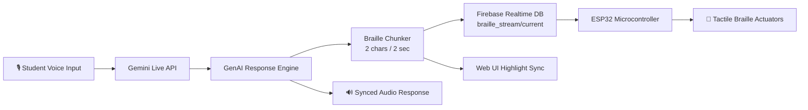

<div align="center">

# ⠃⠗⠁⠊⠇⠇⠑ &nbsp; Braille Assist

### A voice-powered, tactile study companion for blind and visually impaired students

*Turning any lesson into something you can hear **and** feel — for the price of a school lunch.*

[](#)
[](#)
[](#)
[](#)
[](#license)

<br/>

<sub>⚠️ Replace the badge links, screenshots, and repo URLs below with your own before publishing.</sub>

</div>

<br/>

## 📖 Table of Contents

- [The Problem](#-the-problem)
- [What is Braille Assist?](#-what-is-braille-assist)
- [Features](#-current-features)
- [How It Works](#-how-it-works)
- [Tech Stack](#-tech-stack)
- [Getting Started](#-getting-started)
- [Hardware Setup](#-hardware-setup-esp32)
- [Roadmap](#-roadmap--visionary-features)
- [Contributing](#-contributing)
- [License](#-license)

<br/>

## 🎯 The Problem

For blind and visually impaired students, everyday classroom life is full of quiet barriers:

| Challenge | Reality Today |
|---|---|
| 📚 **Traditional Braille books** | Bulky, slow to produce, and outdated the moment the curriculum changes |
| 💸 **Refreshable Braille displays** | Commercial 40-cell hardware can cost **thousands of dollars** |
| 🧑‍🏫 **Classroom independence** | Students often rely on sighted assistance just to track homework and schedules |

**Braille Assist** exists to close that gap — with software that's smart, hardware that's cheap, and an experience that respects a student's independence.

<br/>

## 💡 What is Braille Assist?

Braille Assist fuses **Generative AI**, **real-time voice conversation**, and **low-cost IoT hardware** (a single ESP32, not a $2,000 display) into one multi-sensory study companion.

Instead of a full 40-cell display, it streams Braille **rhythmically**, two characters at a time, over a $15–$30 microcontroller setup — reinforcing literacy through **hearing and touch at once**.

> 🦻 + 🤚 = 🧠 — Dual-sensory input reinforces spelling, grammar, and tactile retention far better than audio alone.

<br/>

## ✨ Current Features

| Feature | What It Does |
|---|---|
| 🔤 **Rhythmic 2-Character Braille Stream** | Chunks AI responses into 2 Braille characters every 2 seconds, with synchronized visual highlight tracking |
| 🔥 **Realtime Firebase IoT Bridge** | Pushes live Braille Unicode + text chunks to Firebase Realtime Database (`braille_stream/current`) for instant microcontroller pickup |
| 🎙️ **Live Bi-Directional Voice Interaction** | Ultra-low-latency voice chat via the Gemini Live API, with real-time PCM audio streaming and natural interruptions |
| 🗓️ **Student Academic Dashboard** | Instant access to daily class schedules, classroom numbers, homework, and school notices |
| 🌐 **Multilingual Voice Recognition** | Supports English (`en-US`) and regional languages like Tamil (`ta-IN`) for inclusive learning |
| ⌨️ **Tactile Braille Chat Interface** | Typed or spoken input, translated live into 6-dot Braille character tiles |
| 🔧 **ESP32 & Arduino Guide Modal** | Built-in wiring guide + downloadable Arduino C++ firmware for the physical actuator pins |
| 🌑 **High-Contrast Dark UI** | Screen-reader-friendly layout with accessible touch targets, high-contrast borders, and full ARIA labeling |

<br/>

## 🔄 How It Works



1. The student asks a question by **voice or text**.
2. The **Gemini Live API** handles real-time conversation, including natural interruptions.
3. Responses are **chunked into Braille** two characters at a time.
4. Chunks are pushed to **Firebase Realtime Database** the instant they're generated.
5. The **ESP32** picks up the stream and drives the physical tactile actuators — in sync with the audio and on-screen highlight.

<br/>

## 🧰 Tech Stack

<div align="center">

| Layer | Technology |
|---|---|
| **AI / Voice** | Gemini Live API (real-time PCM audio) |
| **Realtime Sync** | Firebase Realtime Database |
| **Microcontroller** | ESP32 (Arduino C++ firmware) |
| **Frontend** | High-contrast, ARIA-compliant Web UI |
| **Localization** | `en-US`, `ta-IN` speech recognition |

</div>

<br/>

## 🚀 Getting Started

```bash
# Clone the repository
git clone https://github.com/<your-username>/braille-assist.git
cd braille-assist

# Install dependencies
npm install

# Set up environment variables
cp .env.example .env
# Add your Gemini API key + Firebase config to .env

# Run the app
npm run dev
```

<sub>Adjust these commands to match your actual project structure (Node/Python/etc.).</sub>

<br/>

## 🔌 Hardware Setup (ESP32)

1. Open the **ESP32 & Arduino Guide Modal** inside the app for the full wiring diagram.
2. Flash the included Arduino C++ firmware to your ESP32.
3. Wire the tactile actuator pins as shown in the guide.
4. Connect the ESP32 to your Firebase Realtime Database credentials.
5. Power on — the device will begin listening on `braille_stream/current`.

> 💵 Total hardware cost: **$15–$30**, versus **$2,000+** for a commercial 40-cell Braille display.

<br/>

## 🗺️ Roadmap — Visionary Features

Planned expansions to turn this into a full assistive-education ecosystem:

- [ ] **Grade 2 Contracted Braille Engine** — standard contractions (`the`, `and`, `ing`) for 30–50% faster reading on compact displays
- [ ] **Nemeth Braille Code for STEM & Math** — LaTeX/MathML → Nemeth Braille for algebra, physics, and chemistry
- [ ] **AI Smart Lens** — point a phone camera at a textbook or blackboard, stream the text straight to Braille
- [ ] **Interactive Braille Speed Trainer** — gamified WPM & accuracy tracking for new and young learners
- [ ] **LMS Integration** — auto-sync assignments and readings from Google Classroom / Canvas
- [ ] **Haptic Campus Wayfinding** — Bluetooth-beacon-guided directional audio for independent navigation

<br/>

## 🤝 Contributing

Contributions, issues, and feature requests are welcome!

1. Fork the project
2. Create your feature branch (`git checkout -b feature/amazing-feature`)
3. Commit your changes (`git commit -m 'Add amazing feature'`)
4. Push to the branch (`git push origin feature/amazing-feature`)
5. Open a Pull Request

<br/>

## 📄 License

Distributed under the **MIT License**. See `LICENSE` for more information.

<br/>

<div align="center">

### 🌟 Built to make independent, tactile learning accessible to every student.

**If this project resonates with you, consider giving it a ⭐!**

</div>
